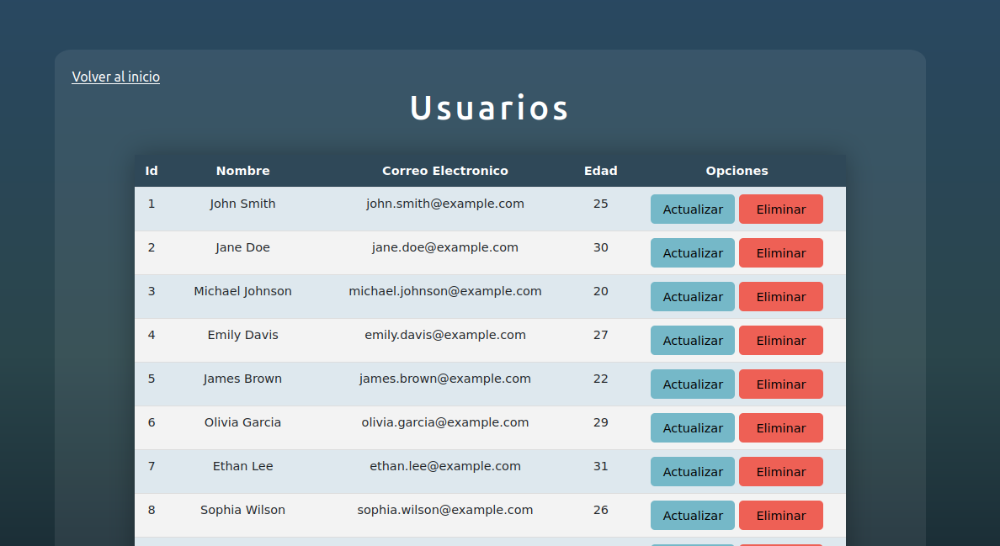

# Simple User CRUD with Node.js, Vanilla JavaScript, and MySQL

## Overview 

This project is a simple Create, Read, Update, Delete (CRUD) application for users built with Node.js and Vanilla JavaScript on the frontend. MySQL is used for data storage and Sequelize is used to perform database queries.

## Technologies Used

- Node.js: for the backend.
- Vanilla JavaScript: for the frontend.
- CSS: for frontend styling and design.
- MySQL: for data storage.
- Sequelize: for performing database queries.

## Features

- Creation of new users with fields for name, email, and password.
- Editing of existing users.
- Deletion of users.
- Listing of all registered users.

# How to Install

1. Clone the repository

        git clone https://github.com/mpauher/user-crud-nodejs-api.git

2. Install npm packages

        npm install

3. Create the database in MySQL.

        script located at `db/test.sql`.

4. Modify the environment variables in the `.env` file to match your database configuration.

5. Run the server

        npm run start

4. Verify the deployment by navigating 

        http://127.0.0.1:3000/

## Contributions

If you'd like to contribute to this project, you're welcome to! You can fork the repository and create a pull request with your changes. They'll be reviewed and merged if approved.

## Authors

- María Paula Hernández :)